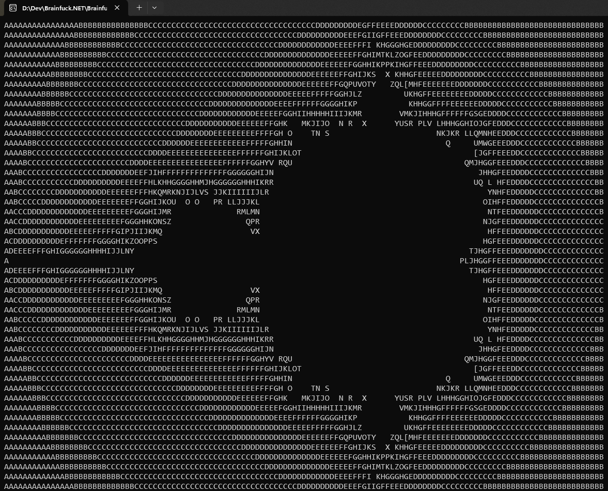

# Brainfuck.NET

A simple toy-compiler which translates brainfuck code to IL code. The output is a runnable .exe file.

## How to use

Run the Brainfuck.NET.exe file from the terminal with the path provided to the brainfuck source code:

`$> Brainfuck.NET.exe mandelbrot.bf`

By default the software looks for a file with the name of `mandelbrot.bf` (which is already provided)
If the compilation was successful the compiler will ask if you'd like to run the compiled software.

## Screenshot from a compiled executable

